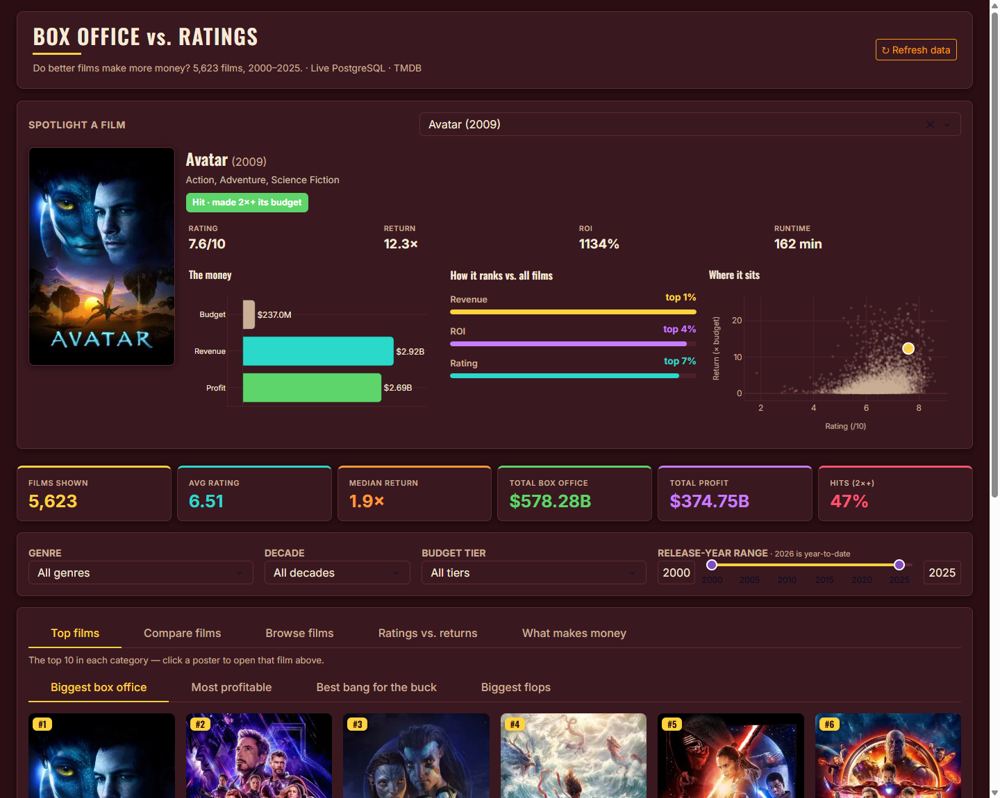
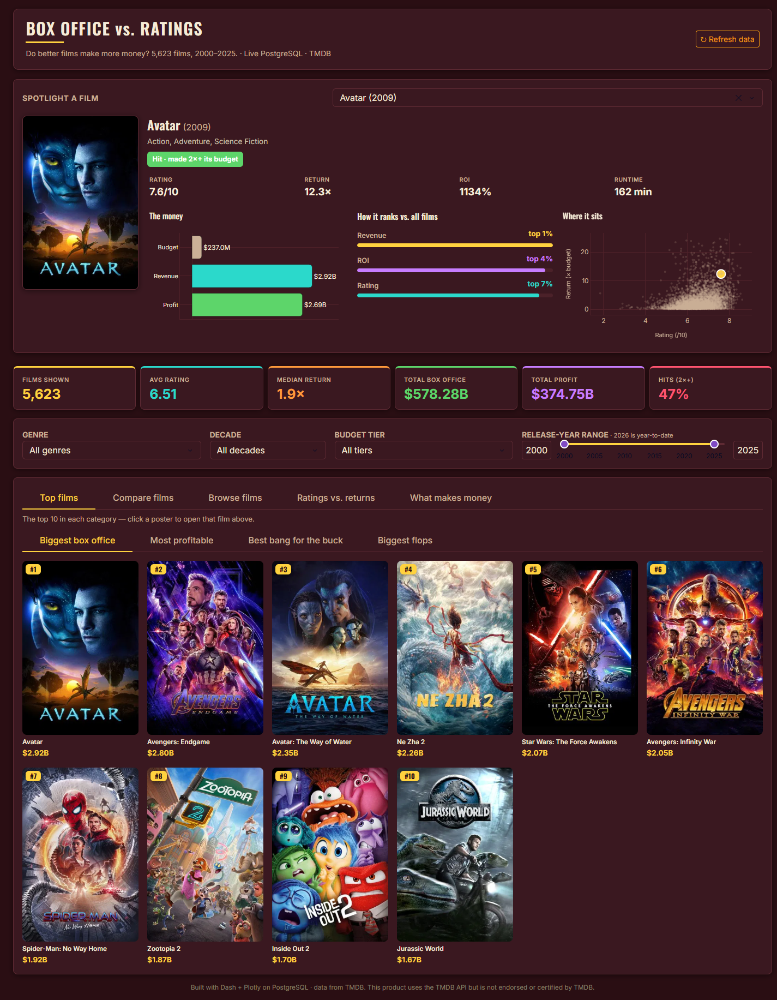
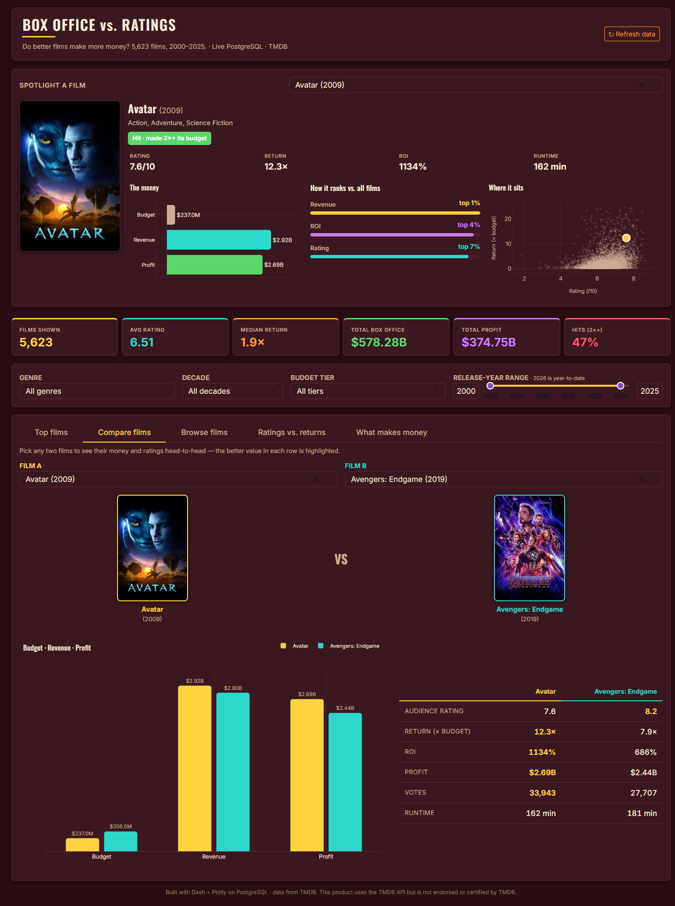
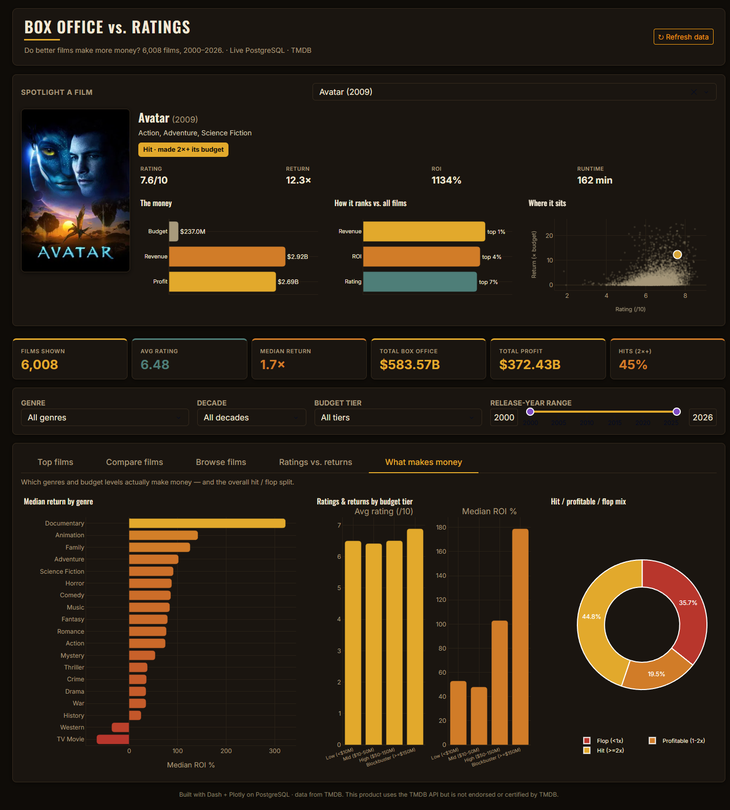

# Box Office vs. Ratings — Interactive Film Analytics

An end-to-end analytics project: a reproducible **Python ETL pipeline** extracts ~6,000
films from the TMDB API (2000–2026), cleans and validates them, and loads them into a
**3NF PostgreSQL** database — which powers an interactive **Dash + Plotly** web
application, themed like a movie theater, for exploring how film budgets, box-office
returns, and audience ratings relate.

**Question:** Do films that earn more also rate higher — and what are the numbers behind
any specific film?

```
TMDB API ─► ETL (clean · validate · load) ─► PostgreSQL (boxoffice, 3NF) ─► Dash app (live SQL)
```

---

## The Dash application — `app.py`

An interactive **film explorer** connected live to PostgreSQL, designed for a live demo:
a dark "movie theater" theme (cinema-gold + teal-and-orange grading), recognizable
content, and a rich page for any individual film.

### Film page (the centerpiece)

Search any film — or click any chart bar, scatter point, or table row — and the top of
the page becomes a full breakdown of that film:

| Panel | What it shows |
|-------|---------------|
| **Poster** | The film's poster (from TMDB, cached locally). |
| **The money** | Budget → Revenue → Profit as a bar, so the scale is instantly readable. |
| **How it ranks vs. all films** | Revenue, ROI, and rating as percentile bars ("top 1%") — context that ties money to ratings for that one film. |
| **Where it sits** | The film's dot highlighted on the ratings-vs-returns scatter of every film. |
| **Headline stats + tier** | Rating, return multiple, ROI, runtime, and a plain-English performance tier (e.g. *"Hit · made 2×+ its budget"*). |



### Tabs

| Tab | What it does |
|-----|--------------|
| **Top films** | Leaderboards of the biggest box office, biggest profit, best return-on-budget, and biggest losses. Click any bar to open that film. |
| **Compare films** | Pick any two films for a head-to-head: a grouped budget/revenue/profit chart plus a stat table with the winning value highlighted. |
| **Browse films** | A sortable, searchable table of every film; click a row to open it. |
| **Ratings vs. returns** | The core question — a rating-vs-return scatter of every film, plus median return by rating band. |
| **What makes money** | Median ROI by genre and by budget tier, and the overall hit / profitable / flop split. |





### KPI cards & filters

Six KPIs — **films shown, avg rating, median return, total box office, total profit, and
hit rate (films that earned ≥2× their budget)** — recompute with the filters (genre,
decade, budget tier, and a release-year range), as do every chart and the table.

### How to run

```powershell
# 1. From the project root, activate the virtual environment
.\venv\Scripts\Activate.ps1

# 2. Install dependencies
pip install -r requirements.txt

# 3. Make sure PostgreSQL is running and loaded (see ETL section below),
#    and that .env has the DB credentials (copy from .env.example).

# 4. (Optional) pre-cache posters for the popular films so they load instantly:
python fetch_posters.py

# 5. Launch the app
python app.py
#    then open http://127.0.0.1:8050
```

### Database integration & demo resilience

The app connects directly to PostgreSQL with SQLAlchemy and runs **one view-based query**
(`v_films_enriched`) at startup / refresh, deriving presentation fields (decade, ROI %,
budget tier, performance) in SQL so the database does the heavy lifting; callbacks then
filter the in-memory frame for instant interactivity. The "Refresh data" button re-queries
the live database.

For a live demo it degrades gracefully: if PostgreSQL is unreachable at startup it
automatically falls back to the `data/films_for_powerbi.csv` snapshot (which mirrors the
view), and the header reflects the active data source. Posters are served from a local
cache (`data/posters.json`); a missing poster fetches once from TMDB and otherwise shows a
placeholder — never a live dependency that can break the demo.

---

## Business insights

- **Better-rated films are far more profitable.** Median return climbs steadily with
  rating: films rated **under 5 lose money**, while films rated **8+ return several times**
  their budget.
- **Bigger budgets pay off.** Blockbusters (>$150M) post the **highest median ROI** *and*
  the best ratings — large bets are well-vetted; the smallest films are the riskiest.
- **Genre matters most.** **Animation** is the sweet spot (high ratings *and* strong
  returns); **Documentaries** post the highest median ROI; Westerns and War the lowest.
- **~45% of films are outright hits** (returning ≥2× their budget).
- **Methodology note:** the project reports **medians**, not means, throughout — a few
  genuine micro-budget viral hits still return huge multiples and would skew any average.

## Data quality & known limitations

TMDB is crowd-sourced and has two systematic gaps that this **box-office** analysis must
correct for, beyond the basic `budget/revenue/votes > 0` rules:

- **Streaming-first films report almost no revenue.** TMDB records only *theatrical* box
  office. Netflix/Amazon originals (e.g. *The Gray Man* — $200M budget, $0.45M recorded
  revenue — *The Irishman*, *Red Notice*, *Wake Up Dead Man*) get a token qualifying
  theatrical run, so they masquerade as nine-figure flops. Their real revenue is
  subscriptions, which isn't public.
- **Placeholder budgets/revenues.** Some rows carry $1–$5 "budgets" that pass `> 0` but
  yield absurd ROI (a $5 budget with $12M revenue = a 2.4-million× return).

The ETL therefore applies a **stricter data-quality filter** (`clean_films`): keep only
films with **budget ≥ $1,000**, **revenue ≥ $1,000**, and **revenue ≥ 5% of budget**. This
drops **349 rows (6,008 → 5,659)**; the per-rule drop counts are logged as data-quality
evidence. The base-table schema keeps the loose `> 0` `CHECK`s so the raw load stays
auditable — the stricter rules live in the transform layer.

---

## The data pipeline — `etl_pipeline.py`

A single, self-contained script that runs the full pipeline end-to-end with no manual steps:

| Stage | What it does |
|-------|--------------|
| **Extract** | Reads cached `data/raw/*.json` by default (fast, deterministic). `--refresh` re-pulls from the live TMDB API (two-stage: `/discover/movie` by year → `/movie/{id}` for budget/revenue), with retry + backoff. |
| **Transform** | pandas cleaning, dtype coercion, dedupe, the **data-quality filter** (placeholder budgets + streaming-only revenue — see *Data quality* above), and derived metrics (`profit`, `roi`, `profit_margin`, `budget_tier`, `performance`, `decade`). |
| **Validate** | data-quality checks (API response, null required fields, duplicate keys, dtypes, ranges, referential integrity, row-count reconciliation), each logged PASS/FAIL. |
| **Load** | Idempotent `INSERT … ON CONFLICT` upserts into `films` / `genres` / `film_genres`. Re-running never duplicates. |

```powershell
python etl_pipeline.py            # cached extract → PostgreSQL + CSV
python etl_pipeline.py --refresh  # re-pull from the live TMDB API first
python etl_pipeline.py --csv-only # skip PostgreSQL, only write the CSVs
```

It also exports analytics-ready CSV snapshots (`data/films_for_powerbi.csv`,
`data/genre_decade_summary.csv`) as a portable, no-database fallback.

## Database schema (3NF)

Three tables plus one analytics view — fully documented in
[`schema_documentation.md`](schema_documentation.md) with an ER diagram.

| Table | Purpose |
|-------|---------|
| `films` | One row per movie (financials, runtime, ratings). PK `film_id`, unique `tmdb_id`. |
| `genres` | TMDB genre lookup (19 rows). |
| `film_genres` | M:N bridge resolving films ↔ genres. |
| `v_films_enriched` | View adding `profit`, `roi`, and a comma-joined genre list — consumed directly by the Dash app. |

**Current load:** 5,659 films (2000–2026 YTD, after the data-quality filter) · 19 genres
· 14,914 film-genre links. *(6,008 raw films are extracted; 349 are dropped as placeholder
or streaming-only revenue — see [Data quality](#data-quality--known-limitations).)*

## Configuration (`.env`)

| Variable | Purpose |
|----------|---------|
| `TMDB_READ_ACCESS_TOKEN` | TMDB v4 bearer token (needed for ETL `--refresh`, a cold cache, and poster fetching) |
| `PG_HOST`, `PG_PORT`, `PG_DATABASE`, `PG_USER`, `PG_PASSWORD` | PostgreSQL connection (database `boxoffice`) |

Secrets live in `.env` (gitignored). `.env.example` is the committed template.

## Tech stack

- Python 3 · pandas · SQLAlchemy 2.0 + psycopg2 · python-dotenv · requests
- **Dash 4 · Plotly 6 · dash-bootstrap-components** (interactive app)
- PostgreSQL 17 (local)

## Repo layout

```
app.py                    Interactive Dash analytics application (the film explorer)
etl_pipeline.py           Full single-file ETL pipeline (extract→transform→validate→load)
fetch_posters.py          One-time TMDB poster pre-cache for the dashboard
schema_documentation.md   Schema docs + ER diagram
load_script.py            Initial PostgreSQL load script (Week 2)
src/extract/              Standalone TMDB fetcher
docs/screenshots/         App screenshots
data/                     CSV snapshots, raw JSON, poster cache (gitignored)
requirements.txt          Python dependencies
```

## Data source

Film data is sourced from [The Movie Database (TMDB) API](https://developer.themoviedb.org/).
This product uses the TMDB API but is not endorsed or certified by TMDB.
