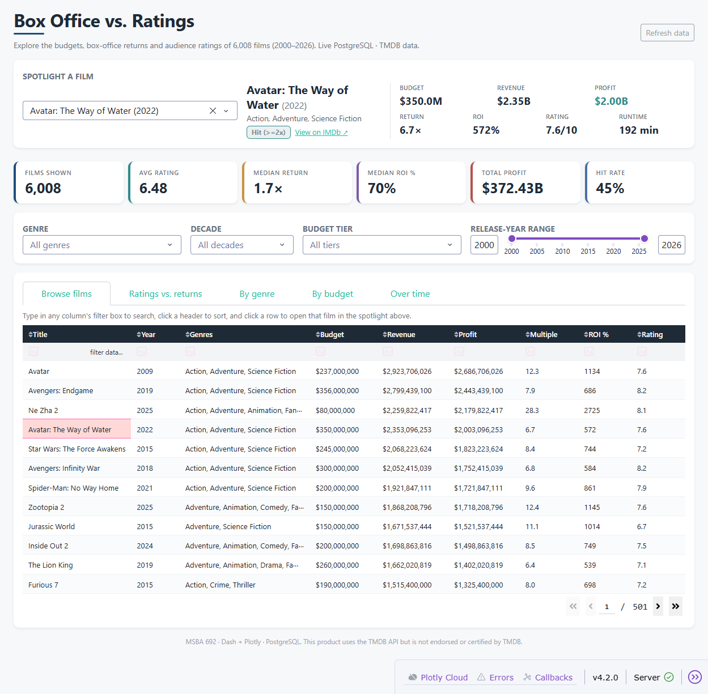
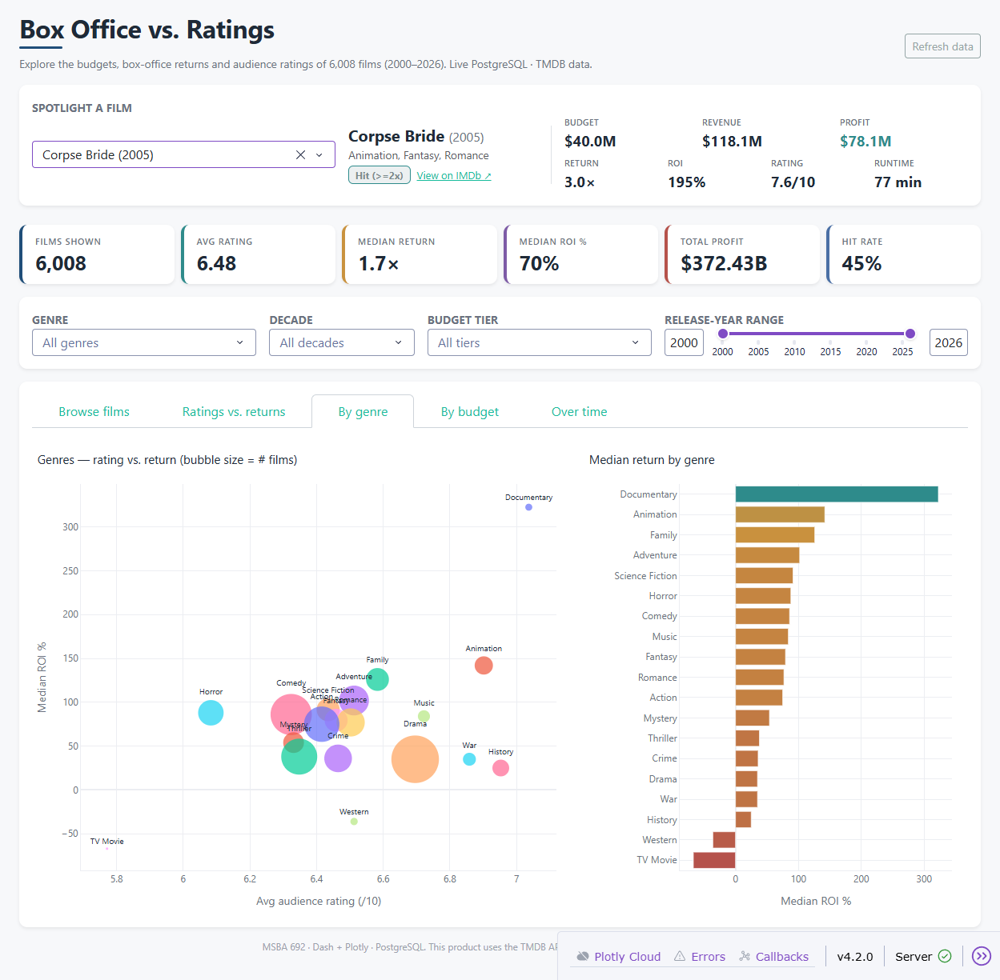

# Box Office vs. Ratings — Interactive Film Analytics

An end-to-end analytics project: a reproducible **Python ETL pipeline** extracts ~6,000
films from the TMDB API (2000–2026), cleans and validates them, and loads them into a
**3NF PostgreSQL** database — which powers an interactive **Dash + Plotly** web
application for exploring how film budgets, box-office returns, and audience ratings
relate.

**Question:** Do films that earn more also rate higher? How does that differ by genre,
budget, and over time — and what are the numbers behind any specific film?

```
TMDB API ─► ETL (clean · validate · load) ─► PostgreSQL (boxoffice, 3NF) ─► Dash app (live SQL)
```

---

## The Dash application — `app.py`

An interactive **film explorer** connected live to PostgreSQL. It is built to *explore*
the data, not just present it.

| Feature | What it does |
|---------|--------------|
| **Spotlight a film** | Search any film by name (or click a chart point / table row) to see its **budget, revenue, profit, ROI, return multiple, rating, runtime**, and an IMDb link. |
| **KPI cards** | Films shown, avg rating, median return, median ROI %, total profit, hit rate — all recompute with the filters. |
| **Filters** | Genre, decade, budget tier, and a release-year range slider — every chart, KPI, and the table update instantly. |
| **Browse films** | A sortable, searchable table of every film; click a row to open it in the spotlight. |
| **Charts** | Ratings vs. returns scatter, return-by-rating band, genre sweet-spot, budget-tier comparison, hit/flop mix, and a ratings-&-returns time trend. |
| **Refresh data** | Re-pulls live from PostgreSQL without restarting the app. |

### How to run

```powershell
# 1. From the project root, activate the virtual environment
.\venv\Scripts\Activate.ps1

# 2. Install dependencies
pip install -r requirements.txt

# 3. Make sure PostgreSQL is running and loaded (see ETL section below),
#    and that .env has the DB credentials (copy from .env.example).

# 4. Launch the app
python app.py
#    then open http://127.0.0.1:8050
```

### Screenshots

**Spotlight + KPIs + browsable film table**


**Genre analysis**


### Database integration

The app connects directly to PostgreSQL with SQLAlchemy and runs **one view-based query**
(`v_films_enriched`) at startup / refresh, deriving presentation fields (decade, ROI %,
budget tier, performance) in SQL so the database does the heavy lifting; callbacks then
filter the in-memory frame for instant interactivity. The "Refresh data" button re-queries
the live database.

---

## Business insights

- **Better-rated films are far more profitable.** Median return climbs steadily with
  rating: films rated **under 5 lose money (−37%)**, while films rated **8+ return +424%**
  of their budget.
- **Bigger budgets pay off.** Blockbusters (>$150M) post the **highest median ROI (179%)**
  *and* the best ratings (6.9) — large bets are well-vetted; the smallest films are the
  riskiest.
- **Genre matters most.** **Animation** is the sweet spot (high ratings *and* strong
  returns); **Documentaries** post the highest median ROI; Westerns and War the lowest.
- **~45% of films are outright hits** (returning ≥2× their budget).
- **Methodology note:** a naive rating-vs-ROI correlation looks near-zero only because a
  handful of micro-budget films return 100×+, distorting the average — which is why this
  project reports **medians**, not means, throughout.

---

## The data pipeline — `etl_pipeline.py`

A single, self-contained script that runs the full pipeline end-to-end with no manual steps:

| Stage | What it does |
|-------|--------------|
| **Extract** | Reads cached `data/raw/*.json` by default (fast, deterministic). `--refresh` re-pulls from the live TMDB API (two-stage: `/discover/movie` by year → `/movie/{id}` for budget/revenue), with retry + backoff. |
| **Transform** | pandas cleaning, dtype coercion, dedupe, and derived metrics (`profit`, `roi`, `profit_margin`, `budget_tier`, `performance`, `decade`). |
| **Validate** | 7 data-quality checks (API response, null required fields, duplicate keys, dtypes, ranges, referential integrity, row-count reconciliation), each logged PASS/FAIL. |
| **Load** | Idempotent `INSERT … ON CONFLICT` upserts into `films` / `genres` / `film_genres`. Re-running never duplicates. |

```powershell
python etl_pipeline.py            # cached extract → PostgreSQL + CSV
python etl_pipeline.py --refresh  # re-pull from the live TMDB API first
python etl_pipeline.py --csv-only # skip PostgreSQL, only write the CSVs
```

It also exports analytics-ready CSV snapshots (`data/films_for_powerbi.csv`,
`data/genre_decade_summary.csv`) as a portable, no-database fallback.

## Database schema (3NF)

Three tables plus one analytics view — fully documented in
[`schema_documentation.md`](schema_documentation.md) with an ER diagram.

| Table | Purpose |
|-------|---------|
| `films` | One row per movie (financials, runtime, ratings). PK `film_id`, unique `tmdb_id`. |
| `genres` | TMDB genre lookup (19 rows). |
| `film_genres` | M:N bridge resolving films ↔ genres. |
| `v_films_enriched` | View adding `profit`, `roi`, and a comma-joined genre list — consumed directly by the Dash app. |

**Current load:** 6,008 films (2000–2026 YTD) · 19 genres · 15,811 film-genre links.

## Configuration (`.env`)

| Variable | Purpose |
|----------|---------|
| `TMDB_READ_ACCESS_TOKEN` | TMDB v4 bearer token (only needed for `--refresh` / a cold cache) |
| `PG_HOST`, `PG_PORT`, `PG_DATABASE`, `PG_USER`, `PG_PASSWORD` | PostgreSQL connection (database `boxoffice`) |

Secrets live in `.env` (gitignored). `.env.example` is the committed template.

## Tech stack

- Python 3 · pandas · SQLAlchemy 2.0 + psycopg2 · python-dotenv
- **Dash 4 · Plotly 6 · dash-bootstrap-components** (interactive app)
- PostgreSQL 17 (local)

## Repo layout

```
app.py                    Interactive Dash analytics application
etl_pipeline.py           Full single-file ETL pipeline (extract→transform→validate→load)
schema_documentation.md   Schema docs + ER diagram
load_script.py            Initial PostgreSQL load script
src/extract/              Standalone TMDB fetcher
docs/screenshots/         App screenshots
data/                     Exported CSV snapshots + raw JSON (gitignored)
requirements.txt          Python dependencies
```

## Data source

Film data is sourced from [The Movie Database (TMDB) API](https://developer.themoviedb.org/).
This product uses the TMDB API but is not endorsed or certified by TMDB.
